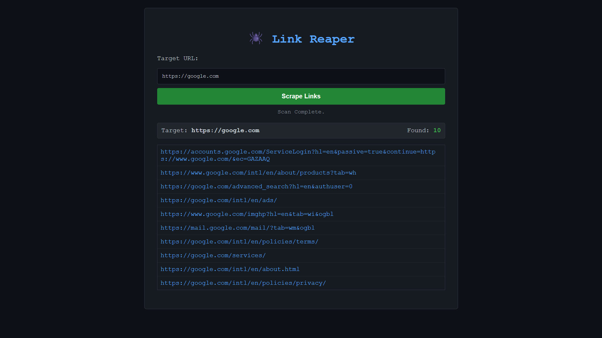

# 🕷️ Link Reaper: The Ultimate Web Crawler


> **A lightweight, high-speed web crawler built for reconnaissance and data gathering.**
> Scrapes target URLs, extracts all internal/external links, and returns structured JSON data or a visual report.

---

## 🚀 **Live Demo**
### [👉 CLICK HERE TO LAUNCH LINK REAPER](https://web-crawler-2mk7.onrender.com/)
*(Hosted on Render Free Tier - Give it 50s to wake up if it's sleeping!)*

---

## 📸 Interface


---

## ⚡ Features
* **🕵️‍♂️ Stealth Mode:** Uses custom User-Agent headers to mimic a real browser and bypass basic anti-bot protections.
* **🌑 Dark Mode UI:** A clean, hacker-style interface for manual scraping.
* **🔗 API-First Design:** Can be used programmatically via cURL or Postman.
* **⚡ Fast Parsing:** Powered by `BeautifulSoup4` for rapid HTML extraction.
* **🛡️ Error Handling:** Gracefully handles 404s, timeouts, and invalid schemes.

---

## 🛠️ API Documentation
Want to use this in your own scripts? You don't need the UI. Just hit the endpoint.

### **Endpoint:** `GET /scrape`

**Parameters:**
- `url` (Required): The target website to crawl.

**Example Request:**
```bash
curl "https://web-crawler-2mk7.onrender.com/scrape?url=https://www.wikipedia.org"
```

Example JSON Response:

```json
{
  "url": "https://www.wikipedia.org",
  "total_links": 325,
  "links": [
    "https://en.wikipedia.org/",
    "https://es.wikipedia.org/",
    "..."
  ]
}
```

---

💻 How to Run Locally (Bypass Geo-Blocks)

Running this tool on your own computer is faster and allows you to access websites that block foreign servers.

1. Clone the Repository
   ```bash
   git clone https://github.com/5uhag/web-crawler.git
   cd web-crawler
   ```
2. Install Dependencies
      You need Python installed. Then run:
   ```bash
   pip install -r requirements.txt
   ```
3. Run the App
   ```bash
   python app.py
   ```
4. Open in Browser
      Go to: http://127.0.0.1:5000

---

⚠️ Limitations & Troubleshooting

1. "Connection Timed Out" on Indian Government Sites
      If you try to scrape websites like karnataka.gov.in or other government portals using the Live Demo, it might fail with a Timeout Error.
      Why? The Live Demo is hosted on Render (USA/Europe Servers). Many government websites use Geo-Blocking to reject all traffic coming from outside their country to prevent cyberattacks.
      The Fix: Run the tool Locally (on your own laptop) using the instructions above. Since your laptop has an Indian IP address, the website will accept your connection.
2. "403 Forbidden"
      Some websites have advanced anti-bot protection (Cloudflare, Akamai). This simple crawler mimics a browser, but it cannot solve CAPTCHAs or execute complex JavaScript.

---

🧠 Tech Stack

· Backend: Python 3, Flask
· Scraping Engine: BeautifulSoup4, Requests
· Frontend: HTML5, CSS3 (Dark Mode), Vanilla JS
· Deployment: Gunicorn, Render Cloud

---

⚠️ Disclaimer

This tool is designed for Educational Purposes and Ethical Hacking (Reconnaissance) only.

· Do not use this to spam or DDoS websites.
· Always respect robots.txt rules on target sites.
· The developer is not responsible for misuse of this tool.

---

👨‍💻 Created by Suhag

Passionate about Cybersecurity, Python, and Web Development.

